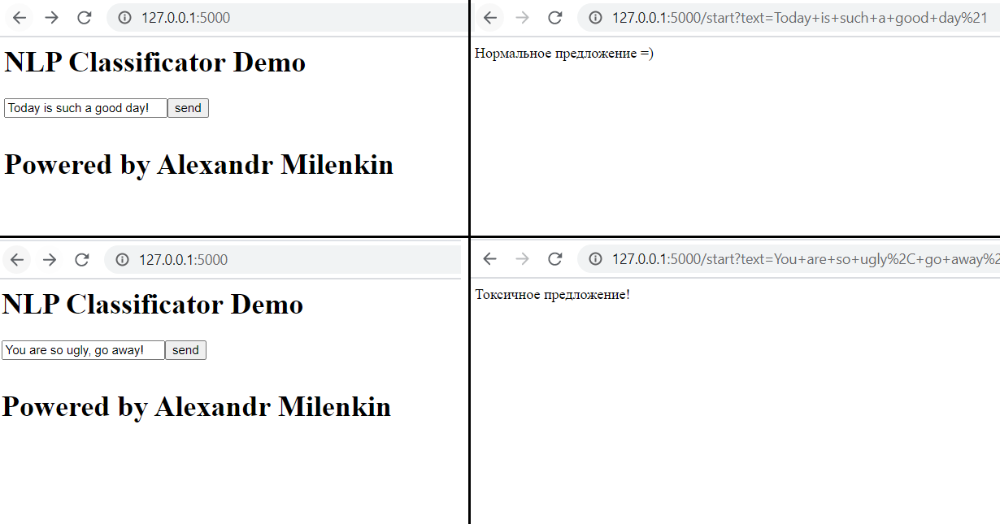

# Python Flask App for NLP Classificator Demo
Toxic coments classificator model with BERT on pytorch

### Описание проекта
Данное веб приложение позволяет определять таксичность текста. 

### Описание пайплайна
Комплекс состоит из двух частей
- app.py - WEB приложение на базе FLASK
- model.py - предобученная модель на базе BERT на данных с соревнований kaggle 

## Инструкция по запуску

## Простой способ запуска работы программы в три шага (для Linux или Window c подсистемой Linux). 
- Шаг № 0: Разархивирует папку flaskapp_Milenkin

- Шаг № 1: Убедиться, что на вашей машине имеются все необходимые библиотеки, включая python
	  Для этого либо смотрим список в requirements.txt (в консоле `pip install -r requirements.txt` ) и ставим все необходимые библиотеки flask/numpy/torch/transformers/nltk/pandas
	  Либо сразу пишем в консоль команду "pip install flask && pip install numpy && pip install torch && pip install transformers && pip install nltk && pip install pandas"

- Шаг № 2: Запукаем модель командой `python3 app.py` или `python app.py` в консоли. Ждем 1-2 минуты, чтобы программа собралась.
- Шаг № 3: Открываем в браузере ссылку http://127.0.0.1:5000/ и пробуем отправить любое английское предложение в окошко. 
	  
		Пример предложения для проверки: "Today is such a good day!" или "You are so ugly, go away!"

**Примечение:** После отправики (нажатия кнопки 'sent') в течениие 3-10 секунд появится класс предложения - токсичное/нормальное предложение. 

## Более сложный способ запуска работы программы через докер в два шага:

### Инсталляция
#### Шаг № 1:  создать докер файл

  `docker build .`

(посмотреть номер имиджа)

#### Шаг № 2: запустить докер контейнер

  `docker run -d -p 5000:5000 [номер имиджа]`

(cмотреть порт 5000)

После запуска контейнера, нужно подождать, пока не появится надпись

  Model loaded

#### Шаг № 3: Открываем в браузере ссылку http://127.0.0.1:5000/ и пробуем отправить любое английское предложение в окошко. 
	  Пример предложения для проверки: "Today is such a good day!" или "You are so ugly, go away!"

**Примечение:** После отправики (нажатия кнопки 'sent') в течениие 3-10 секунд появится класс предложения - токсичное/нормальное предложение. 

## Дополниельные команды:
### удалить  докер контейнер по окончанию работы

  `docker ps`   # посмотреть номер контейнера
  `docker rm -а [номер контейнера]`   # удалить по номеру контейнера

#### примечание
можно запускать программы в разных консолях без докера (см выше)

#### Характеристики модели:
 - Точность модели примерно 96%
 - Использовался предобученный эмбендинг (BERT)
